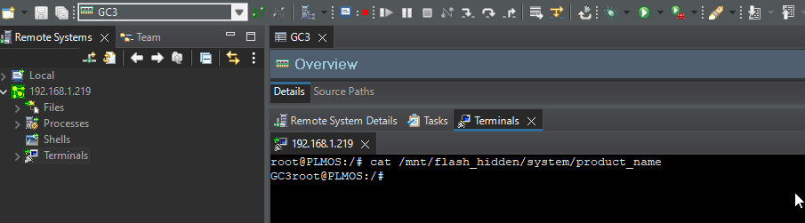

# TCF Agent Service Exposed on Foresight Sports GC3 Launch Monitor

## Vendors

* Foresight Sports
* Bushnell

## Affected Products

Bushnell Launch Pro (Foresight Sports GC3 Launch Monitor)

## Summary

The Foresight GC3 Launch Monitor ships with a Target Communication Framework (TCF) service enabled. This service listens on a TCP port on all interfaces and allows for process debugging, file system modification, and terminal access as the `root` user. In conjunction with a hosted wireless access point and a known passphrase "FSSPORTS", an attacker could use this service to modify a device and steal intellectual property.

## Remediation/Mitigation

Update to firmware version 1.5.0.2.

## Credit

This issue was found by Tom Steele of Atredis Partners

## References

* https://nvd.nist.gov/vuln/detail/CVE-2022-40187
* https://github.com/atredispartners/advisories/ATREDIS-2022-0003.md
* https://www.bushnellgolf.com/products/launch-monitors/launch-pro/
* https://www.foresightsports.com/gc3
* https://wiki.eclipse.org/TCF

## Report Timeline

* 2022-08-09: Atredis Partners contacts vendor for initial notification.
* 2022-08-09: Vendor responds requesting vulnerability information.
* 2022-08-11: Vendor requests meeting to discuss technical details.
* 2022-08-15: Atredis Partners meets with vendor and sends draft advisory.
* 2022-08-25: Vendor releases updated firmware.
* 2022-09-06: Atredis Partners reports vulnerability to MITRE for CVE ID assignment.
* 2022-10-12: Atredis Partners publishes advisory ATREDIS-2022-0003

## Technical Details

The GC3 Launch Monitor is shipped with the TCF Agent service enabled.

```sh
nmap -p 1534 192.168.1.219 -Pn
Starting Nmap 7.80 ( https://nmap.org ) at 2022-06-24 17:04 MDT
Nmap scan report for 192.168.1.219
Host is up (0.00047s latency).

PORT     STATE SERVICE
1534/tcp open  micromuse-lm

Nmap done: 1 IP address (1 host up) scanned in 1.08 seconds
```

This service is typically used for debugging and development. It allows for the filesystem to be modified, process debugging, and terminal access as the `root` user.

```sh
nc 192.168.1.219 1534
ELocatorHello["ZeroCopy","Diagnostics","Profiler","Disassembly","DPrintf","Terminals","PathMap","Streams","Expressions","SysMonitor","FileSystem","ProcessesV1","Processes","LineNumbers","SymbolsProxyV2","SymbolsProxyV1","Symbols","StackTrace","Registers","MemoryMap","Memory","Breakpoints","RunControl","ContextQuery","Locator"]^
```

Atredis Partners leveraged the TCF eclipse plugin gain access to the device as `root`.



With `root` access it is possible to modify the device, recover encrypted firmware images, and communicate with the Foresight Sports API.

The GC3 device also runs hostapd to support local WiFi connections. Typically this is done using a mobile device such as an iPhone. The SSID is GC3-{serial number} and the psk is "FSSPORTS". This password appears to the the same for every GC3 device and can not be changed by the user.

Once connected to the AP, a client is given an IP address on a 192.168.100.0/24 network. The TCF service is also listening on this interface. Network scanning can be used to quickly identify the device. The IP addresses of the device are listed here.
```sh
root@PLMOS:/# awk '/\|--/ && !/\.0$|\.255$/ {print $2}' /proc/net/fib_trie

127.0.0.1
192.168.1.219
192.168.100.76
127.0.0.1
192.168.1.219
192.168.100.76
```

It would be trivial for an attacker to perform the following:
* Identify GC3-* AP
* Connect to AP and connect to TCF service
* Either leave the device in an unrecoverable state or install a backdoor that could be used to access a user's network later